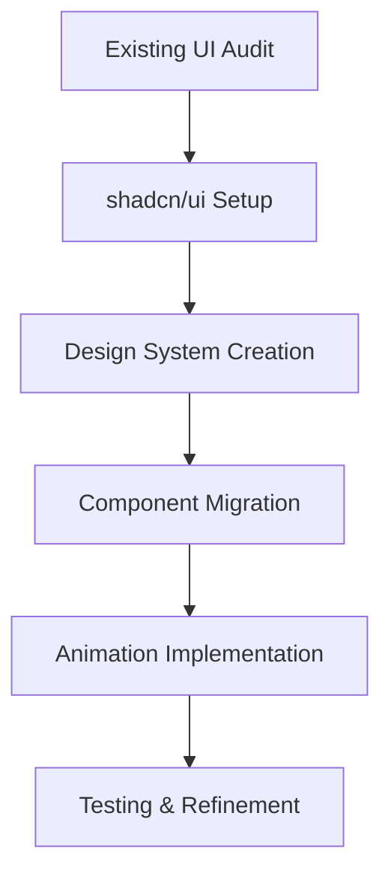

## 1. Product Overview
Enhance the existing application UI using shadcn/ui components to create a modern, visually appealing interface with consistent design patterns, animations, and improved user experience.

## 2. Core Features

### 2.1 UI Enhancement Scope
The UI enhancement project consists of the following main areas:
1. **Component Migration**: Replace existing UI components with shadcn/ui equivalents
2. **Design System**: Establish consistent color palette, typography, and spacing
3. **Animation System**: Implement smooth transitions and micro-interactions
4. **Responsive Design**: Ensure optimal experience across all device sizes

### 2.2 Feature Module
Our UI enhancement requirements consist of the following main components:
1. **Design System Setup**: Color palette, typography scale, spacing system
2. **Component Library**: shadcn/ui integration and custom component creation
3. **Animation Guidelines**: Transition patterns, hover effects, loading states
4. **Migration Strategy**: Step-by-step component replacement plan

### 2.3 Page Details
| Page Name | Module Name | Feature description |
|-----------|-------------|---------------------|
| Global | Design Tokens | Define primary/secondary colors, success/error states, neutral grays. Create CSS custom properties for consistent theming. |
| Global | Typography | Set up font hierarchy with shadcn/ui default font (Inter), establish heading sizes, body text, and utility classes. |
| Global | Component Mapping | Map existing buttons, forms, cards, modals to shadcn/ui equivalents with enhanced styling. |
| Global | Animation System | Implement framer-motion for page transitions, hover effects, loading skeletons, and scroll animations. |
| Global | Dark Mode | Configure shadcn/ui dark mode support with appropriate color tokens and toggle functionality. |

## 3. Core Process
**UI Enhancement Flow:**
1. Audit existing components and identify replacement candidates
2. Set up shadcn/ui with custom configuration
3. Implement design tokens and CSS variables
4. Migrate components systematically (high-impact first)
5. Add animations and micro-interactions
6. Test responsive behavior and accessibility

## 4. User Interface Design
### 4.1 Design Style
**Color Palette:**
- Primary: #0F172A (Slate 900) - Main brand color
- Secondary: #6366F1 (Indigo 500) - Interactive elements
- Success: #10B981 (Emerald 500) - Positive actions
- Warning: #F59E0B (Amber 500) - Cautions
- Error: #EF4444 (Red 500) - Errors
- Background: #FFFFFF / #0F172A (Light/Dark)
- Surface: #F8FAFC (Slate 50) / #1E293B (Slate 800)

**Component Style:**
- Buttons: Rounded corners (8px), subtle shadows, hover transitions
- Cards: Clean borders, soft shadows, hover lift effects
- Forms: Clean inputs with focus rings, validation states
- Typography: Inter font family, systematic scale (14px-48px)

**Animation Principles:**
- Duration: 200-300ms for micro-interactions
- Easing: ease-in-out for natural movement
- Transforms: Scale, opacity, and translate for smooth effects

### 4.2 Component Mapping Overview
| Existing Component | shadcn/ui Replacement | Enhancement Features |
|-------------------|----------------------|----------------------|
| Custom Button | Button | Loading states, variants, sizes, animations |
| Basic Form | Form + Input | Validation, error states, focus animations |
| Plain Cards | Card | Hover effects, better shadows, content layout |
| Modals | Dialog | Smooth open/close animations, backdrop blur |
| Navigation | NavigationMenu | Mobile-responsive, active states |

### 4.3 Migration Strategy
**Phase 1: Foundation (Week 1)**
- Install shadcn/ui and configure design tokens
- Set up CSS custom properties and dark mode
- Create base component wrappers

**Phase 2: Core Components (Week 2)**
- Replace buttons, forms, and cards
- Implement consistent spacing and typography
- Add basic hover/focus animations

**Phase 3: Advanced Components (Week 3)**
- Migrate modals, navigation, and data displays
- Implement complex animations and transitions
- Add loading states and skeletons

**Phase 4: Polish & Testing (Week 4)**
- Fine-tune animations and responsive behavior
- Accessibility audit and improvements
- Performance optimization and cleanup