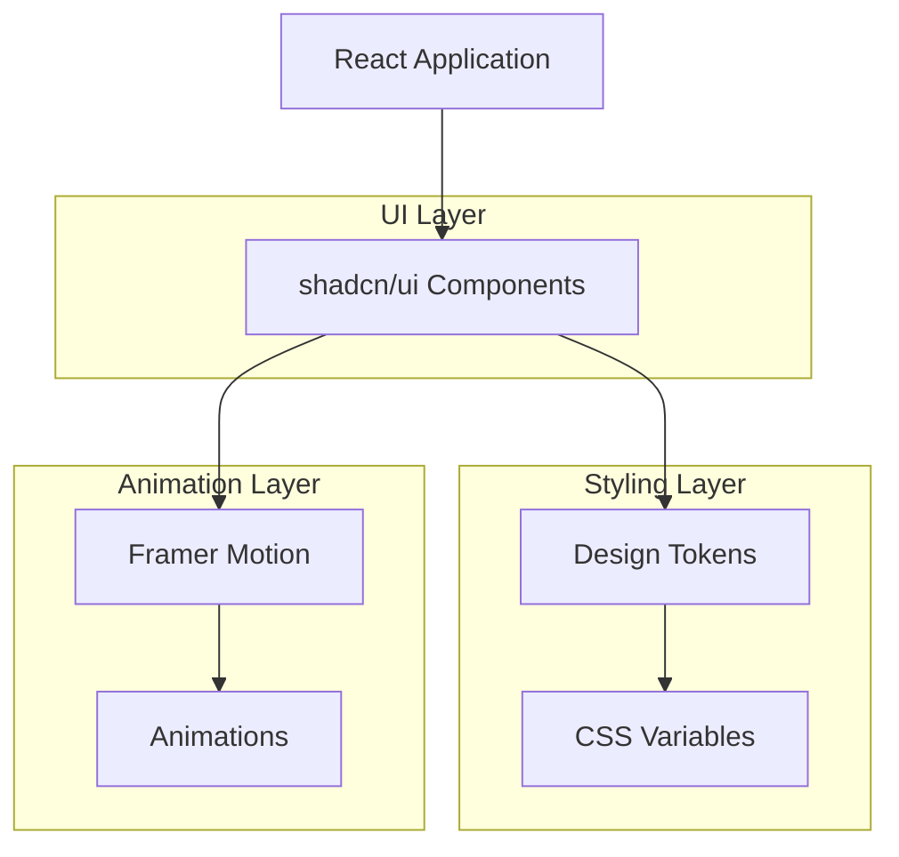
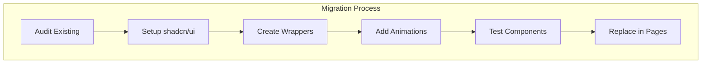

## 1. Architecture design



## 2. Technology Description

* Frontend: React\@18 + shadcn/ui + TailwindCSS\@3 + Framer Motion

* Initialization Tool: vite-init

* Styling: TailwindCSS with custom design tokens

* Animation: Framer Motion for smooth transitions

* Icons: Lucide React (included with shadcn/ui)

## 3. Route definitions

| Route       | Purpose                                                     |
| ----------- | ----------------------------------------------------------- |
| /           | Home page with enhanced hero section and component showcase |
| /components | Component library reference page                            |
| /theme      | Theme customization and color palette preview               |

## 4. Component Architecture

### 4.1 Core Component Structure

```typescript
// Enhanced Button with animations
interface EnhancedButtonProps {
  variant?: 'default' | 'destructive' | 'outline' | 'secondary' | 'ghost' | 'link'
  size?: 'default' | 'sm' | 'lg' | 'icon'
  loading?: boolean
  animation?: 'scale' | 'fade' | 'slide'
  children: React.ReactNode
}
```

### 4.2 Animation Configuration

```typescript
// Motion variants for consistent animations
export const fadeIn = {
  initial: { opacity: 0, y: 20 },
  animate: { opacity: 1, y: 0 },
  transition: { duration: 0.3, ease: "easeInOut" }
}

export const scaleIn = {
  initial: { scale: 0.95, opacity: 0 },
  animate: { scale: 1, opacity: 1 },
  transition: { duration: 0.2 }
}
```

## 5. Component Migration Strategy



## 6. Design Token Implementation

### 6.1 CSS Variables Structure

```css
:root {
  /* Colors */
  --primary: 222.2 47.4% 11.2%;
  --primary-foreground: 210 40% 98%;
  --secondary: 210 40% 96.1%;
  --secondary-foreground: 222.2 47.4% 11.2%;
  
  /* Spacing */
  --spacing-unit: 0.25rem;
  --radius: 0.5rem;
  
  /* Animations */
  --animation-duration: 200ms;
  --animation-easing: ease-in-out;
}
```

### 6.2 Tailwind Configuration

```javascript
// tailwind.config.js extensions
module.exports = {
  theme: {
    extend: {
      animation: {
        'fade-in': 'fadeIn 0.3s ease-in-out',
        'slide-up': 'slideUp 0.3s ease-out',
        'scale-in': 'scaleIn 0.2s ease-out'
      },
      keyframes: {
        fadeIn: {
          '0%': { opacity: '0', transform: 'translateY(10px)' },
          '100%': { opacity: '1', transform: 'translateY(0)' }
        },
        slideUp: {
          '0%': { transform: 'translateY(20px)', opacity: '0' },
          '100%': { transform: 'translateY(0)', opacity: '1' }
        },
        scaleIn: {
          '0%': { transform: 'scale(0.95)', opacity: '0' },
          '100%': { transform: 'scale(1)', opacity: '1' }
        }
      }
    }
  }
}
```

## 7. Migration Implementation Steps

### 7.1 Initial Setup

```bash
# Install shadcn/ui
npx shadcn-ui@latest init

# Add core components
npx shadcn-ui@latest add button card form input dialog

# Install animation library
npm install framer-motion
```

### 7.2 Component Enhancement Pattern

```typescript
// Enhanced component wrapper
import { Button } from '@/components/ui/button'
import { motion } from 'framer-motion'

export const EnhancedButton = ({ children, loading, animation = 'scale', ...props }) => {
  return (
    <motion.div
      whileHover={{ scale: 1.05 }}
      whileTap={{ scale: 0.95 }}
      initial={animation === 'scale' ? { scale: 0.95, opacity: 0 } : { opacity: 0 }}
      animate={animation === 'scale' ? { scale: 1, opacity: 1 } : { opacity: 1 }}
      transition={{ duration: 0.2 }}
    >
      <Button {...props} disabled={loading}>
        {loading ? <Loader2 className="mr-2 h-4 w-4 animate-spin" /> : children}
      </Button>
    </motion.div>
  )
}
```

